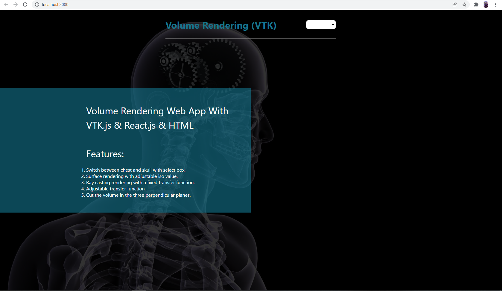
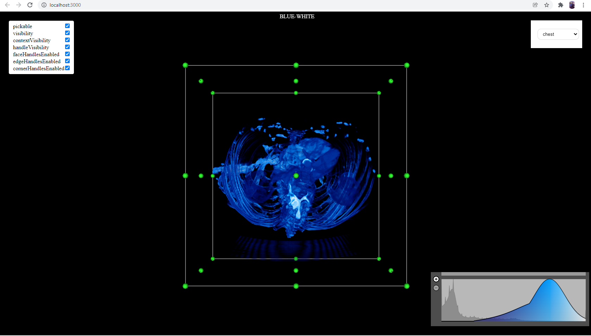
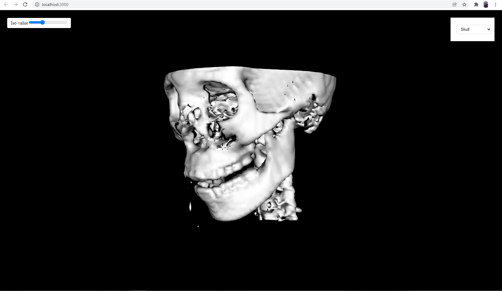
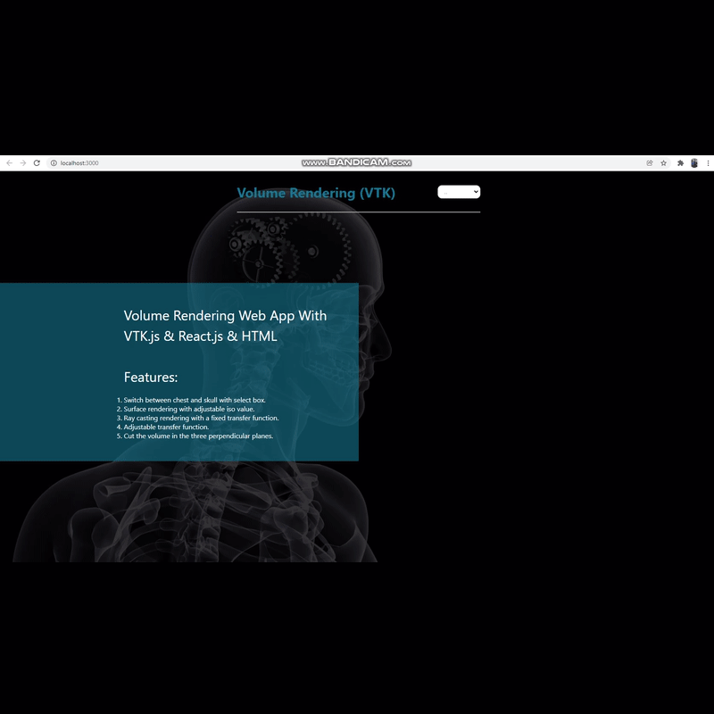
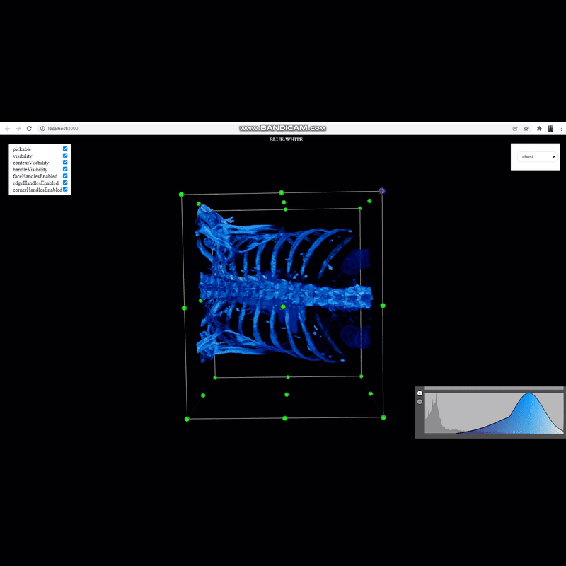
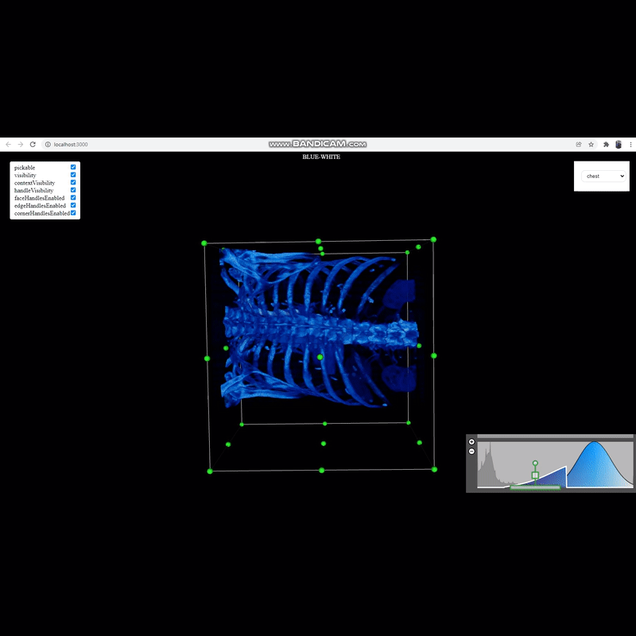
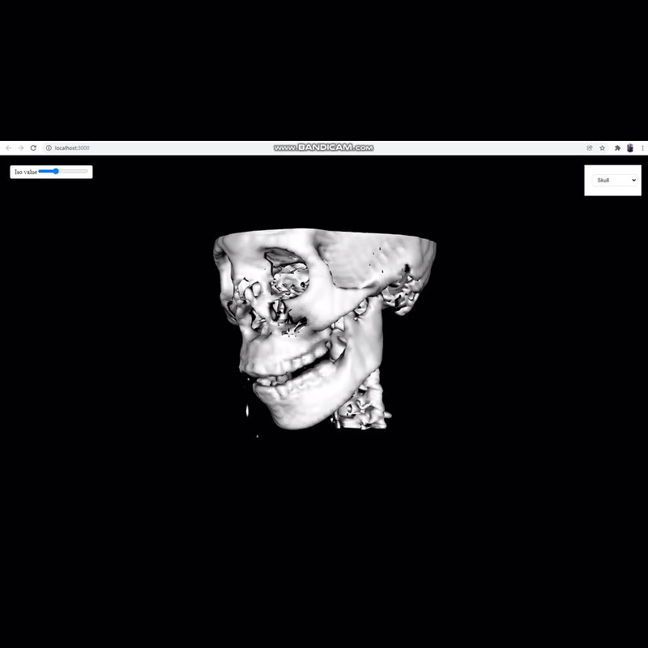

# SBE306 Assignment 4 (VTK) 

* data : Directory containing Head and chest datasets 

## Description
A 3D medical viewer built with vtk-js

## Team
### Team Name : team22
### Team Members
| Name         | Section     | BN |
|--------------|-----------|------------|
| mohamed zakaria hussen    | 2 | 15       |
| mohamed reda fathy | 2      | 14        |
| hesham gamal shaaban     | 2 | 45       |
| ahmed gamil      | 1 | 4       |


<div style="page-break-after: always;"></div>

## Task Objectives
##### 1. Running Examples From VTK Website
##### 2. Building Web GUI
##### 3. Linking Two Examples(Skull & Chest)
##### 4. Croping, Ray Casting , Transfer function in chest and shift preset.
##### 5. Surface rendering with adjustable iso value
##### 6. Issues


<div style="page-break-after: always;"></div>

## Running Examples From VTK Website
After installing React and Node.js we have run the examples from the vtk website and solved some issues we will mention below.


## Building Web GUI
We Created a react project with two main files one for the Skull Code and the other for the Chest Code. We connected the two main files through a Home page that enabled us to move from one example to the other. We created the Home page with some HTML And CSS code to make it a little Functional. We made it available to move from one example to another through one tab.
We choosed this way to enable us to add another example in a simple way through adding its file and add acomponent for it in home page.

## 1.Home page



code for home page:
```javascript
import { F } from '@kitware/vtk.js/Common/Core/Math/index';
import React, { Component } from 'react';
import swap from './index';
class Home_page extends Component {
    state={
        flag:2
    };
    constructor(){
        super();

    };
    render() { 
            return (
            <div className='landing'>
              <div className='overlay'>
              <div className="text">
                    <div className="content">
                        <h2>Volume Rendering Web App With VTK.js & React.js & HTML<br/><br/>
                            Features:
                        </h2>
                        <ol>
                          <li>Switch between chest and skull with select box.</li>
                          <li>Surface rendering with adjustable iso value.</li>
                          <li>Ray casting rendering with a fixed transfer function.</li>
                          <li>Adjustable transfer function.</li>
                          <li>Cut the volume in the three perpendicular planes.</li>

                        </ol>
                    </div>
                </div>
                <div className="container">
            <h1>Volume Rendering (VTK)</h1>
            <nav>
                <select value={0} onChange={(e) => this.handleClick(e.target.value)}>
                      <option value={0}>..</option>
            <option value={0}>chest</option>
            <option value={1}>Skull</option>
            </select>
            </nav>
        </div>
              </div>
              </div>
                  );
        }
    flag_value(){
        return this.state.flag;
    }
     handleClick = (flag) => {
         this.state.flag=flag;
         swap(flag);
}
}


// (e) => this.handleClick(e.target.value)
export default Home_page;
```

In this "App.jsx" we defined a class of home page with flag value = 2 which changes from one example to another. Then we created the html code for the home page which includes navbar that contains the heading of the project and a select box to jump between examples and a description of our project and its features. We build a function called handleClick which works when the select box changes and returns its value to swap function that we will discuss later.

## 2.Chest example



We created a function called chest that returns an html component <div> that references the full screen of chest example.
  ```javascript
  <div>
      <div ref={vtkContainerRef} />
      ..........
```
 We used the React Hook (useRef) 
```javascript
  function Chest() {
  const vtkContainerRef = useRef(null);
      ..........
```
 When we call this function, useEffect would be called building our example.
    
```javascript
    useEffect(() => {
    if (!context.current) {
      const fullScreenRenderer = vtkFullScreenRenderWindow.newInstance({
        background: [0, 0, 0],
        rootContainer: vtkContainerRef.current,//the <div> element for rendering
    .........
```

## 3.Skull example



We created a function called skull that returns an html component <div> that references the full screen of skull example.
  ```javascript
  <div>
      <div ref={vtkContainerRef} />
      ..........
```
 We used the React Hook (useRef) 

```javascript
  function Skull() {
  const vtkContainerRef = useRef(null);
      ..........
```
 When we call this function, useEffect would be called building our example.
    
```javascript
    useEffect(() => {
    useEffect(() => {
    if (!context.current) {
      const fullScreenRenderWindow = vtkFullScreenRenderWindow.newInstance({
        background: [0, 0, 0],
        rootContainer: vtkContainerRef.current
    .........
 ```
## Linking Two Examples(Skull & Chest)
We linked the two examples though a combobox we created in the home page and made it available to move from one example to another and vice verse without any need to return to the Home page.



code of linking between three pages:

```javascript
        const home=new Home_page();
        const flag=home.flag_value();
        swap(flag);
        function swap(flag){
        if (flag==2){
        ReactDOM.render(
            <Home_page />
            ,document.getElementById('root'));

        }else if (flag==0){
            ReactDOM.render(
                <Chest />
                ,document.getElementById('root'));
        }else {
            ReactDOM.render(
                <Skull />
                ,document.getElementById('root'));
        }
        }
```

This function takes a variable flag which comes from handleClick function which works when the selectbox changes.It checks if the flag didn't change (=2) it would render the home page and if the flag changed to 0 it would render the chest example, otherwise it would render the skull example.
The function handleClick exists in class Home_Page
```javascript
            class Home_page extends Component {
            state={
                flag:2
            };
            constructor(){
                super();
```

## Croping, Ray Casting and Transfer function in chest
You can crop any part you want from chest through some points. You also can control which points you want to show and control them through some checkboxes on the lef of page.



```javascript
            function widgetRegistration(e) {
            const action = e ? e.currentTarget.dataset.action : 'addWidget';
            const viewWidget = widgetManager[action](widgetCrop);
            if (viewWidget) {
              viewWidget.setDisplayCallback((coords) => {
                overlay.style.left = '-100px';
                if (coords) {
                  const [w, h] = apiRenderWindow.getSize();
                  overlay.style.left = `${Math.round(
                    (coords[0][0] / w) * window.innerWidth -
                      overlaySize * 0.5 -
                      overlayBorder
                  )}px`;
                  overlay.style.top = `${Math.round(
                    ((h - coords[0][1]) / h) * window.innerHeight -
                      overlaySize * 0.5 -
                      overlayBorder
                  )}px`;
                }
              });
              renderer.resetCamera();
              renderer.resetCameraClippingRange();
            }
            widgetManager.enablePicking();
            renderWindow.render();
```
      ##..........
      
```javascript
            function updateFlag(e) {
            const value = !!e.target.checked;
            const name = e.currentTarget.dataset.name;
            widgetCrop.set({ [name]: value }); // can be called on either viewWidget or parentWidget

            widgetManager.enablePicking();
            renderWindow.render();
            }

```
      ##........
```javascript
            function getCroppingPlanes(imageData, ijkPlanes) {
            const rotation = quat.create();
            mat4.getRotation(rotation, imageData.getIndexToWorld());

            const rotateVec = (vec) => {
                const out = [0, 0, 0];
                vec3.transformQuat(out, vec, rotation);
                return out;
              };
```
We also added the adjustable transfer function feature for the chest.



```javascript
              function changePreset(delta = 1) {
              presetIndex =
                (presetIndex + delta + vtkColorMaps.rgbPresetNames.length) %
                vtkColorMaps.rgbPresetNames.length;
              lookupTable.applyColorMap(
                vtkColorMaps.getPresetByName(vtkColorMaps.rgbPresetNames[presetIndex])
              );
              lookupTable.setMappingRange(...globalDataRange);
              lookupTable.updateRange();
              labelContainer.innerHTML = vtkColorMaps.rgbPresetNames[presetIndex];
            }
```
      ##....
```javascript
              const widget = vtkPiecewiseGaussianWidget.newInstance({
              numberOfBins: 256,
              size: [400, 150],
            });
            widget.updateStyle({
              backgroundColor: 'rgba(255, 255, 255, 0.6)',
              histogramColor: 'rgba(100, 100, 100, 0.5)',
              strokeColor: 'rgb(0, 0, 0)',
              activeColor: 'rgb(255, 255, 255)',
              handleColor: 'rgb(50, 150, 50)',
              buttonDisableFillColor: 'rgba(255, 255, 255, 0.5)',
              buttonDisableStrokeColor: 'rgba(0, 0, 0, 0.5)',
              buttonStrokeColor: 'rgba(0, 0, 0, 1)',
              buttonFillColor: 'rgba(255, 255, 255, 1)',
              strokeWidth: 2,
              activeStrokeWidth: 3,
              buttonStrokeWidth: 1.5,
              handleWidth: 3,
              iconSize: 20, // Can be 0 if you want to remove buttons (dblClick for (+) / rightClick for (-))
              padding: 10,
            });

            fullScreenRenderer.setResizeCallback(({ width, height }) => {
              widget.setSize(Math.min(450, width - 10), 150);
```
## Surface rendering with adjustable isoValue
              we setted a controlPanel to our render
```javescript
                    const controlPanel =`<table>
                    <tr>
                      <td>Iso value</td>
                      <td>
                        <input class='isoValue' type="range" min="0.0" max="1.0" step="0.05" value="0.0" />
                      </td>
                    </tr>
                    </table>

                    `;
```
and we link it with 
```javescript
     fullScreenRenderWindow.addController(controlPanel);
```
```javascript 
              const el = document.querySelector('.isoValue');
              el.setAttribute('min', dataRange[0]);
              el.setAttribute('max', dataRange[1]);
              el.setAttribute('value', firstIsoValue);
              el.addEventListener('input', updateIsoValue);
```
      the function updataIsoValue
```javascript
            function updateIsoValue(e) {
              const isoValue = Number(e.target.value);
              console.log("Ggggggggg",isoValue);
              marchingCube.setContourValue(isoValue);
                renderWindow.render();
               }
```


## Issues
1.We had to learn React.js to run our examples with html.
2.We weren't able to understand vtk.js code.
      
      
##### Note:This is a breif of our code, we have commited the whole code.
